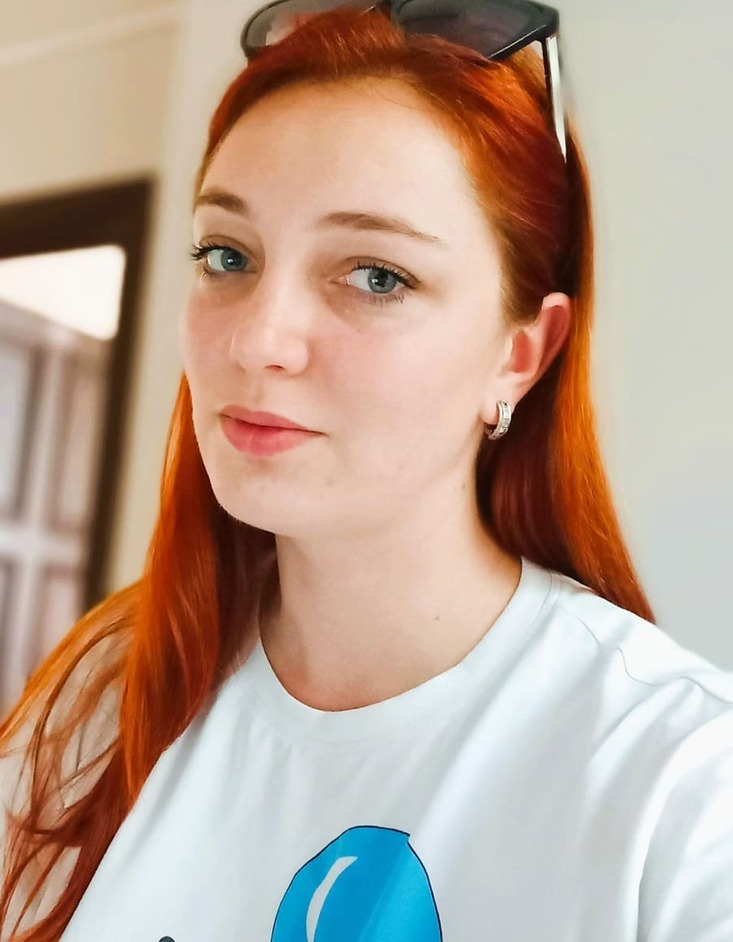

# Olga Kucheiko
---
e-mail: KucheikoOlga@gmail.com

Discord: Olga Kucheiko (@olgashebeda)

tg: @ole4ka_olka

---

I am a passionnate and fast learner willing to start a career in IT. I have experience teaching information technology
at Brest college for about a two years. The technology stack included PHP, Node.js, UX/UI, html/css and JS. 
Moreover, I have good written and
verbal communication skills. I have the ability to communicate effectively in both independent and team environments.

---

* html
* CSS
* SCSS/SASS
* JavaScripte
* Node.js
* UX/UI
* PHP
* MySQL
* Git/GitHub

---
```
function createPhoneNumber(numbers){
var num1 = [];
var num2 = [];
var num3 = [];
for (let i=0; i<numbers.length;i++){ if (i<3) num1[i]=numbers[i]; if (i<6 && i>2)
   num2[i]=numbers[i];
   if (i>5 )
   num3[i]=numbers[i];
   }
   num1= num1.join('');
   num3 = num3.join('');
   num2= num2.join('');
   const str = '('+ num1 + ') '+ num2 + '-'+ num3;
   return str;
   }
   ```
   https://github.com/OlgaShebeda

   thes is page,
   coursework
   

   Master, Brest State University, Brest

   Course RS Scoole, 2022

   * English: A2+
   * Russian: native
   * Belarussian: B2
   * Spanish: A1